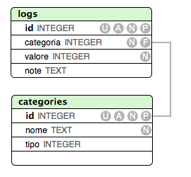

# Contabilità domestica: un'introduzione al web development con ruby on rails


#### [Railsgirls Udine - 5 e 6 giugno 2014](http://http://railsgirls.com/udine)


## Cosa e come:

Al termine di questo tutorial avremo sviluppato l'architettura di base di una semplice applicazione per gestire la contabilità domestica in base ad uno schema che prevede un registro di entrate e uscite distinte in categorie.

Sarà possibile inserire categorie per entrate o uscite e registrare le singole voci di registro associandole alla categoria di riferimento.

Sarà possibile inoltre visualizzare separatamente un riassunto delle entrate e delle uscite divise per categoria accompagnato da un grafico a torta per una rappresentazione più chiara del rapporto tra le varie categorie di spesa/ricavo.

Potremo 'assaggiare' ruby/ruby on rails e anche un pizzico di javascript, che utilizzeremo per i grafici grazie alla libreria visualize fornita come plugin per jquery.

Va da sè che si tratta di un'abbozzo di applicazione, invito chi fosse interessato a completarla e proporre eventuali direzioni di sviluppo.

## A chi è diretto questo tutorial:

Questo documento è pensato principalmente in funzione dell'evento railsgirls che si terrà a Udine il 5 e 6 giugno 2014.
E' accessibile ad un'utenza con nozioni elementari di sviluppo web.

## Come leggerlo:

- I comandi da inserire direttamente nella shell/prompt dei comandi (il metodo consigliato è fare copia e incolla) sono indicati in **_grassetto corsivo_** come nell'esempio qui sotto

**_cd contabilita_domestica_**

- le porzioni di codice sono visualizzate come l'esempio che segue

```
  <div class="control-group">
    <%= f.label :category_id, :class => 'control-label' %>
    <div class="controls">
      <%= f.collection_select :category_id, Category.all, :id, :nome, prompt: false %>
    </div>
  </div>
```

## Prerequisiti:

Devono essere installati sul sistema

- Ruby 1.9
- rails
- un editor di testo avanzato (sublime text - notepad++ - textmate) o un'ide (aptana studio - rubymine)

## Cominciamo !

###Predisponiamo una directory per i nostri progetti rails

Dopo aver scelto la posizione nel filesystem in cui vogliamo conservare i nostri progetti in rails, creiamo la directory che li conterrà

**_mkdir railsgirls_**

e spostiamoci al suo interno

**_cd railsgirls_**

###Lasciamo che rails costruisca lo scheletro del sistema

Ruby on rails è un framework evoluto, che offre una serie di comandi shell grazie ai quali predisporre un'applicazione è davvero semplice e rapido.

**_rails new contabilita_domestica_**

Il comando appena eseguito genera un output piuttosto interessante: rails ha creato per noi tutti i file necessari allo sviluppo della nostra prima applicazione e la struttura delle directory del progetto.
>MVC: un pattern architetturale in grado di separare la logica di presentazione dei dati dalla logica di business.

>Guardate dentro la cartella app, rails ha creato una directory chiamata **models**, una directory chiamata **views** e una directory chiamata **controllers**

(unix/linux/osx) **_cd contabilita_domestica/app_**

(windows) **_cd contabilita_domestica\app_**

###Configuriamo l'applicazione affinchè includa le librerie che ci serviranno per il progetto

Per la formattazione di una pagina web (un'applicazione web è composta di varie pagine) si utilizza una combinazione di HTML per il markup, la definizione della struttura semantica della pagina (distinguere titoli, paragrafi, tabelle ecc.) e di CSS per la formattazione effettiva dei vari elementi della pagina (definizione dei colori, font, impaginazione degli elementi ecc.)

Da qualche anno hanno preso piede sul web dei framework CSS che incorporano soluzioni consolidate per i problemi più comuni legati alla creazione di una pagina web.

In questa sede intendiamo utilizzare **bootstrap**, un framework rilasciato da alcuni sviluppatori di twitter, che ci permetterà di ottenere con poche operazioni un layout ordinato e facilmente personalizzabile.

>**RubyGems** è un gestore di pacchetti per il linguaggio di programmazione Ruby che fornisce un formato standard, per distribuire i programmi e le librerie scritti in Ruby, chiamato gems (dall'inglese: gemme) è inoltre uno strumento progettato per facilitare la gestione dell'installazione delle "gemme" e per la loro distribuzione.

L'ecosistema di ruby on rails è in costante evoluzione, e molte librerie vengono aggiornate con frequenza. Questo espone i programmi scritti con una determinata versione al rischio di incompatibilità e potenziali errori futuri.

rails utilizza un sistema di gestione delle librerie o gemme chiamato bundler, che permette di definire per ciascuna libreria la versione esatta richiesta, per mitigare il problema.

L'esecuzione di bundler si basa su un file di configurazione, chiamato **Gemfile** che si trova nella directory root del progetto
___

Apriamo Gemfile con l'ide/editor

Decommentiamo la riga

```
# gem 'therubyracer', platforms: :ruby
```
che diventa così

```
gem 'therubyracer', platforms: :ruby
```
Aggiungiamo le seguenti righe

```
# aggiungo twitter bootstrap 3 e relativi generators
gem 'bootstrap-sass'
gem 'bootstrap-generators'
```
---
A questo punto dobbiamo installare le librerie nella nostra applicazione, e lo facciamo utilizzando bundler con il comando

**_bundle install_**

Consiglio di leggere l'output del programma, come spesso accade con rails è molto informativo.

Una volta completata l'installazione delle gemme, **bootstrap** è disponibile e utilizzabile.

Dicevo che rails dispone di diversi strumenti richiamabili da linea di comando che rendono la scrittura di un'applicazione divertente. Per la nostra applicazione ci faremo aiutare da un'utilità che nel gergo di rails si chiama generator. Un comando che genera automaticamente lo scheletro dei file che compongono l'applicazione (per ora magari credetemi sulla parola :smile: )

Quello che manca per integrare completamente bootstrap nella nostra applicazione è la riconfigurazione automatica dei generators, che otteniamo digitando il comando

_**rails g bootstrap:install**_

###Due parole sul database

La nostra applicazione si basa su un database molto semplice, composto di due tabelle, categories e logs. La tabella categorie ha un campo denominato 'tipo' che è booleano, ovvero può assumere solo due valori, vero o falso.

La utilizzeremo per determinare se la categoria sia di entrata (true) o di uscita (false)

La tabella logs contiene una chiave esterna, denominata 'category_id', che associa ogni riga di registro ad una categoria.
Utilizzeremo sqlite, che è il database di default per le applicazioni rails


( _il programma che ho utilizzato per generare il diagramma sotto non mi permetteva di impostare un campo booleano_ )



###Lasciamo che rails abbozzi la struttura dell'applicazione


rails g scaffold Category nome:string tipo:boolean periodico:boolean data:date

rails g scaffold Log valore:integer note:text category:references

rake db:migrate RAILS_ENV=development


routes

modifica layout

modifiche form e tabelle

visualize


rails s

:feet:

:see_no_evil: :hear_no_evil: :speak_no_evil: